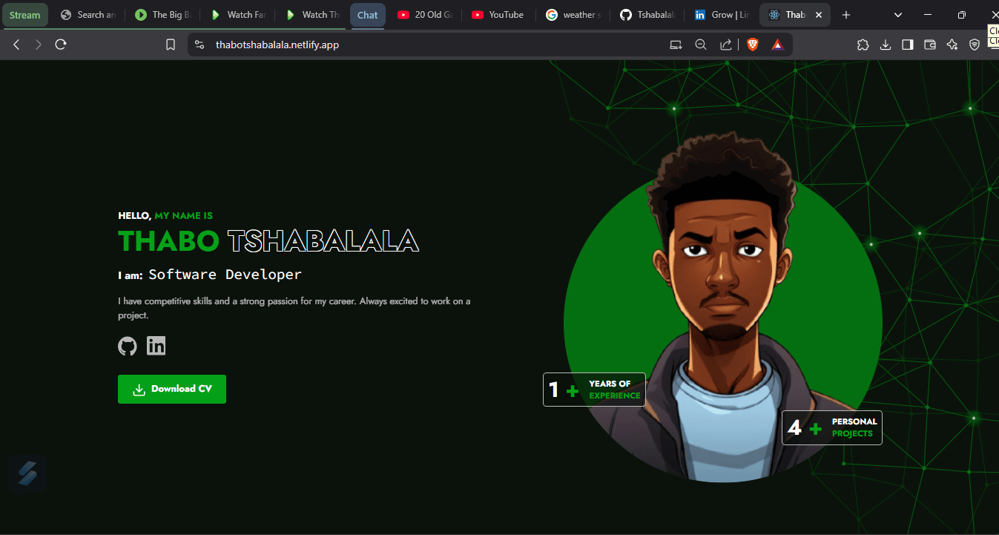

# React Portfolio

A modern, responsive portfolio website built with React, featuring a clean design, animated components, and showcasing professional experience and projects.



## Features

- 🎨 Modern UI with animated components
- 📱 Fully responsive design
- ⚡ Interactive project showcase
- 🌗 Professional skills section
- 📄 Downloadable CV
- 🔄 Loading animations
- 💼 Experience timeline
- 🎓 Education history

## Technologies Used

- React.js
- Tailwind CSS
- Framer Motion
- Headless UI
- Lucide React Icons

## Prerequisites

Before you begin, ensure you have the following installed:
- Node.js (v14.0.0 or higher)
- npm (v6.0.0 or higher)

## Getting Started

1. Clone the repository:
```bash
git clone https://github.com/your-username/react-portfolio.git
```
2. Navigate to the project directory:
```bash
npm install
```
3. Install dependencies:
```bash
npm install
```
4. Start the development server:
```bash
npm start
```
4. Open your browser and visit:
http://localhost:3000

## Getting Started

react-portfolio/
├── public/
│   ├── images/
│   │   ├── projects/
│   │   ├── polygons.svg
│   │   └── card-polygons.svg
│   └── ThaboTshabalala_CV_10_2024.pdf
├── src/
│   ├── components/
│   │   ├── AnimatedText.js
│   │   └── BounceLoader.js
│   ├── App.js
│   └── index.js
└── README.md
